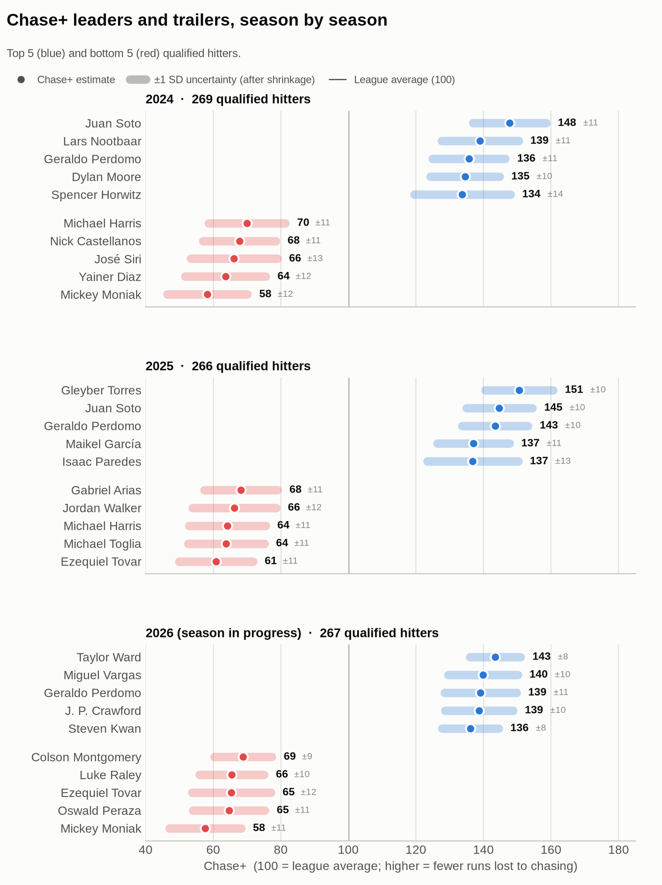
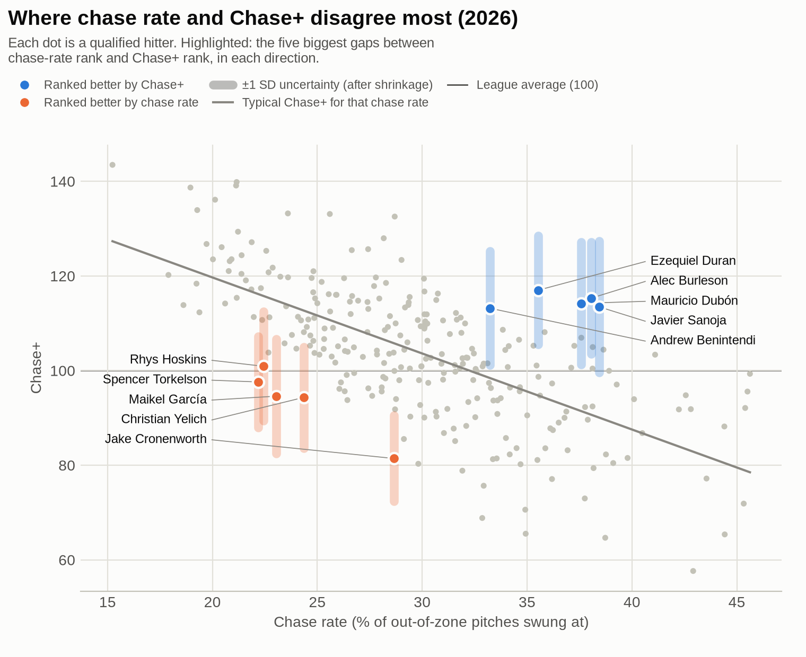
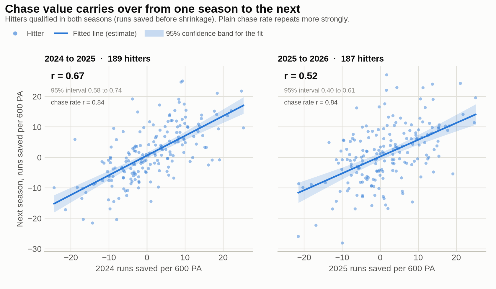

# Chase Value (Chase+)

Chase rate counts how often a hitter swings at pitches outside the zone,
and it treats every one of those swings as the same mistake. They aren't.
On average a chase on 3-2 costs about 5.6 times as many runs as a chase on
0-1. This project prices every chase decision in runs using Statcast data,
builds a per-season leaderboard and a Chase+ score, and then tests whether
the numbers hold up.

**How to read the charts:** a solid mark (dot, line or bold number) is the
estimate. The pale band or bar behind it, or the small ± figure, is its
uncertainty. A thin gray line marks the league average (Chase+ = 100).

## Results

### Why price chases instead of counting them

<picture>
  <source media="(prefers-color-scheme: dark)" srcset="results/figures/chase_cost_by_count_dark.png">
  
</picture>

A chase with three balls costs far more than one early in the count.
Chase rate treats those as the same mistake; this project doesn't.

### Leaders and trailers, season by season

<picture>
  <source media="(prefers-color-scheme: dark)" srcset="results/figures/leaderboard_by_season_dark.png">
  
</picture>

About 265-270 hitters qualify each season. A Chase+ of 130 is about the
top 3-5% of qualified hitters. Full tables are in
`results/chase_cost_leaderboard_<season>.csv`.

<details>
<summary>Top 5 and bottom 5 as tables</summary>

**2024** (269 qualified hitters)

| Rank | Player | PA | Chase% | Runs saved / 600 PA | Chase+ ± 1 SD |
|---:|---|---:|---:|---:|---|
| 1 | Juan Soto | 710 | 18.0% | +17.5 | **148** ± 11 |
| 2 | Lars Nootbaar | 404 | 17.0% | +14.3 | **139** ± 11 |
| 3 | Geraldo Perdomo | 387 | 19.0% | +13.1 | **136** ± 11 |
| 4 | Dylan Moore | 438 | 18.0% | +12.6 | **135** ± 10 |
| 5 | Spencer Horwitz | 381 | 26.0% | +12.4 | **134** ± 14 |
| | ... | | | | |
| 265 | Michael Harris | 469 | 40.0% | -11.0 | **70** ± 11 |
| 266 | Nick Castellanos | 659 | 37.9% | -11.8 | **68** ± 11 |
| 267 | José Siri | 449 | 35.6% | -12.4 | **66** ± 13 |
| 268 | Yainer Diaz | 621 | 42.8% | -13.3 | **64** ± 12 |
| 269 | Mickey Moniak | 418 | 39.1% | -15.3 | **58** ± 12 |

**2025** (266 qualified hitters)

| Rank | Player | PA | Chase% | Runs saved / 600 PA | Chase+ ± 1 SD |
|---:|---|---:|---:|---:|---|
| 1 | Gleyber Torres | 627 | 17.2% | +18.8 | **151** ± 10 |
| 2 | Juan Soto | 707 | 15.9% | +16.6 | **145** ± 10 |
| 3 | Geraldo Perdomo | 720 | 19.0% | +16.2 | **143** ± 10 |
| 4 | Maikel García | 669 | 20.9% | +13.8 | **137** ± 11 |
| 5 | Isaac Paredes | 439 | 21.5% | +13.7 | **137** ± 13 |
| | ... | | | | |
| 262 | Gabriel Arias | 470 | 39.0% | -11.8 | **68** ± 11 |
| 263 | Jordan Walker | 394 | 34.1% | -12.6 | **66** ± 12 |
| 264 | Michael Harris | 640 | 43.2% | -13.3 | **64** ± 11 |
| 265 | Michael Toglia | 337 | 30.8% | -13.5 | **64** ± 11 |
| 266 | Ezequiel Tovar | 391 | 40.9% | -14.6 | **61** ± 11 |

**2026** (267 qualified hitters, season in progress)

| Rank | Player | PA | Chase% | Runs saved / 600 PA | Chase+ ± 1 SD |
|---:|---|---:|---:|---:|---|
| 1 | Taylor Ward | 590 | 15.2% | +18.7 | **143** ± 8 |
| 2 | Miguel Vargas | 619 | 21.2% | +17.1 | **140** ± 10 |
| 3 | Geraldo Perdomo | 608 | 21.1% | +16.8 | **139** ± 11 |
| 4 | J. P. Crawford | 413 | 18.9% | +16.6 | **139** ± 10 |
| 5 | Steven Kwan | 567 | 20.1% | +15.5 | **136** ± 8 |
| | ... | | | | |
| 263 | Colson Montgomery | 571 | 32.9% | -13.4 | **69** ± 9 |
| 264 | Luke Raley | 284 | 34.9% | -14.8 | **66** ± 10 |
| 265 | Ezequiel Tovar | 463 | 44.4% | -14.9 | **65** ± 12 |
| 266 | Oswald Peraza | 344 | 38.7% | -15.2 | **65** ± 11 |
| 267 | Mickey Moniak | 392 | 42.9% | -18.2 | **58** ± 11 |

</details>

### What chase rate misses

<picture>
  <source media="(prefers-color-scheme: dark)" srcset="results/figures/chase_plus_vs_chase_rate_dark.png">
  
</picture>

Some hitters chase often but mostly when it's cheap, and some rarely
chase but pay for it when they do. The highlighted hitters are the
biggest disagreements between the two rankings. Chase value also
correlates about 0.35 with overall offensive value each season. Chase
rate's correlation is weaker, between -0.13 and -0.23.

### Does it repeat?

<picture>
  <source media="(prefers-color-scheme: dark)" srcset="results/figures/reliability_dark.png">
  
</picture>

Yes, moderately. Chase value is a persistent hitter trait, with
year-to-year r of 0.67 and 0.52. It is noisier than plain chase rate,
which comes in at 0.84 both times.

## How it works

1. **Price each chase.** Cost = the value of taking the pitch minus the value
   of what the swing produced. Both values come from count run values built
   from the data. The take side weighs "ball" against "called strike" using
   a called-strike model. That model is a logistic regression fit separately
   for each season, on distance outside the zone plus the count. A whiff adds
   a strike, a foul adds a strike unless there are already two, and a ball in
   play gets its actual run value.
2. **Compare to the league.** Each pitch is compared with what the league
   lost on average on the same kind of pitch: same season, count and
   distance bucket. That way a hitter isn't charged for working deep counts
   or credited for taking pitches nowhere near the zone.
3. **Shrink small samples.** Each hitter-season is pulled toward its
   season's mean in proportion to its standard error, using the
   DerSimonian-Laird estimator.
4. **Put it on a Chase+ scale.**

   ```
   chase_plus = 100 + 100 * runs_saved_shrunk / league_chase_cost_per_600_pa
   ```

   100 is league average. 130 means a hitter saved runs worth 30% of what
   an average hitter lost to chasing that season.

The called-strike model, league baseline, shrinkage, ranks and
qualification floors are all computed one season at a time. The league
environment shifts from year to year, and 2026 is the first season under
MLB's ABS Challenge System.

## Reading the leaderboard

| Question | Column |
|---|---|
| Who was better within one season? | `runs_saved_shrunk` (runs per 600 PA vs. that season's league) |
| Who was more dominant, comparable across seasons? | `chase_plus` (100 = league average) |
| How many runs on one fixed yardstick? | `runs_saved_vs_anchor_shrunk` (every season priced against 2024) |

- **League chase cost:** the league lost 36.6, 37.2 and 42.9 runs per 600 PA
  to chasing in 2024, 2025 and 2026.
- **Uncertainty:** the charts and tables show ± `chase_plus_posterior_sd`,
  the uncertainty left after shrinkage (usually 9-14 points). The
  leaderboard files also have `chase_plus_se`, the standard error before
  shrinkage (usually about 14 points).
- **Other files:** `chase_cost_leaderboard.csv` adds each hitter's qualified
  seasons into one career line. `hitter_value_leaderboard.csv` places chase
  value next to total offense.

**Qualifying:** a hitter needs 600 out-of-zone pitches seen and 300 plate
appearances in a season. A season still in progress gets proportionally
lower floors. 2026 currently has 90% of a full season's games. There is no
chase-count minimum, but `cost_per_chase` is left blank for hitters with
fewer than 120 chases.

## Limitations

- **Shrinkage is a little too strong at the extremes.** The most and least
  disciplined hitters come out about 3 runs per 600 PA too close to average
  (7-8 Chase+ points), so the top and bottom values are understated.
- **The called-strike model ignores which side of the zone a pitch
  missed.** Takes just above the zone are called strikes more often than
  the model predicts, and corners less often. This changes hitter values
  by roughly 0.2-0.4 runs per 600 PA.
- **The run value tables are pooled across all three seasons.** That
  covers the base-out, event and count values. Everything listed above is
  per season, but these tables are not.
- **2026 is harder to compare with earlier years.** It is an in-progress
  season, and Statcast records its zone boundaries differently from
  2024-2025. The models show 2026 calls differing from earlier seasons but
  can't say why.

## Running it

```
python -m venv .venv
source .venv/bin/activate
pip install -r requirements.txt
```

Run the scripts in order. Each one overwrites its own outputs.

| Step | Script | What it does |
|---|---|---|
| 1 | `scripts/02_download_baseline.py` | Downloads Statcast data by month with `pybaseball` into `data/raw/` |
| 2 | `scripts/03_build_chase_dataset.py` | Cleans and labels pitches (swing, zone, chase) |
| 3 | `scripts/BuildRunValueTables.py` | Builds run expectancy, event and count run values |
| 4 | `scripts/buildchaseleaderboard.py` | Prices chases, fits the models, writes the leaderboards |
| 5 | `scripts/BuildHitterValueLeaderboard.py` | Compares chase value with total offense |
| 6 | `scripts/BuildChaseReliability.py` | Tests year-to-year repeatability |
| 7 | `scripts/check_chase_invariants.py` | Runs the consistency checks (below) |
| 8 | `scripts/make_figures.py` | Draws the README charts and prints the tables |

`buildchaseleaderboard.py` prints a short summary by default. Add
`--diagnostics` for the model and calibration tables, or `--verbose` for
full explanations too. The flags only change what is printed.

The Statcast data files in `data/` are not committed, because the raw pull
is several hundred MB. `results/` is committed, so the leaderboards and
charts can be viewed without running anything.

## Checks

`python scripts/check_chase_invariants.py` rebuilds the key numbers from
the pitch level and runs 21 checks, including:

- league runs saved add to zero and league Chase+ is exactly 100
- qualification follows the stated rule
- shrinkage matches DerSimonian-Laird and never overshoots
- the called-strike rate never rises with distance
- the out-of-fold model check doesn't leak
- the results on disk came from the current script and data (checked with
  a fingerprint)

Add `--rerun` to also rerun the leaderboard and confirm it writes
byte-identical files.

## Use of AI

AI tools (Claude) were used for code cleanup, refactoring and review, and
to build the chart script. Changes were checked against the invariant
tests above and by comparing outputs before and after on the same data.
