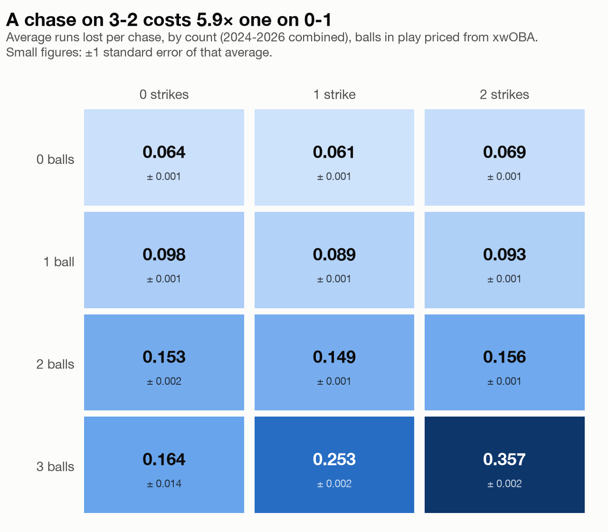
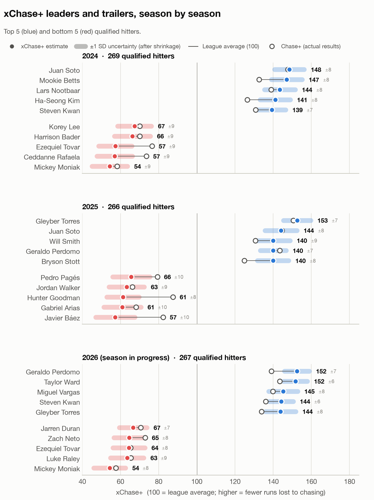
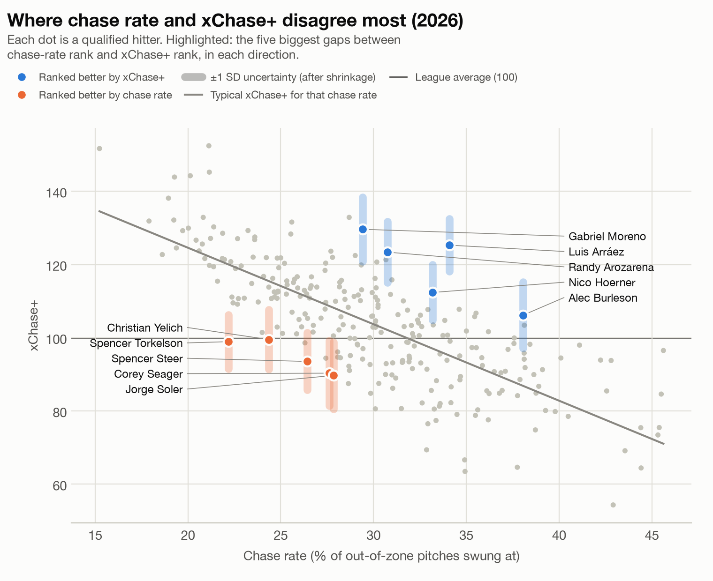
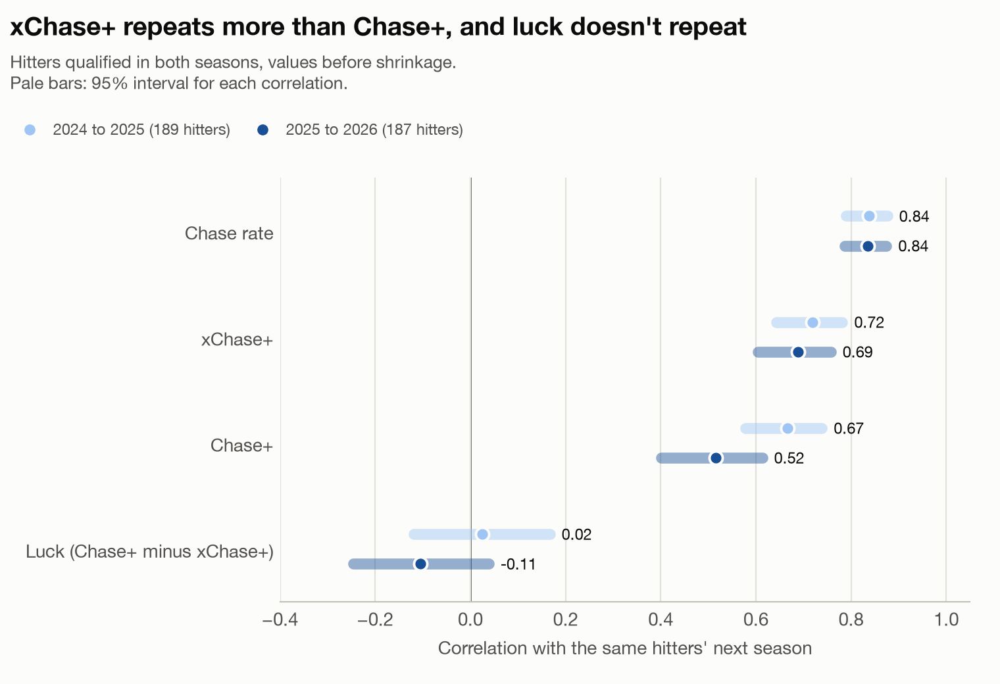
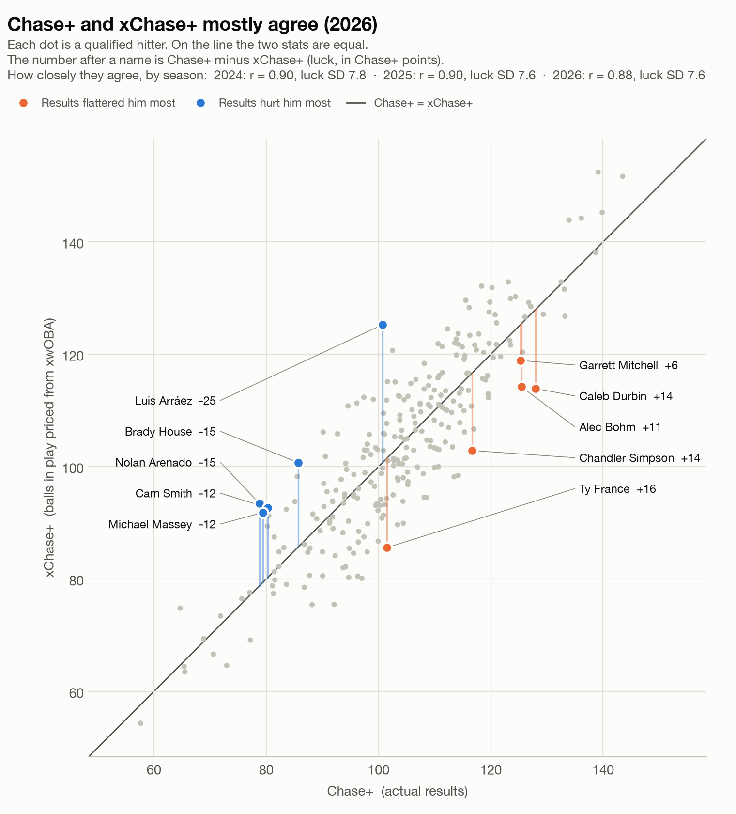

# Chase Value (xChase+ and Chase+)

Chase rate counts how often a hitter swings at pitches outside the zone,
and it treats every one of those swings as the same mistake. They aren't.
On average a chase on 3-2 costs about 5.9 times as many runs as a chase on
0-1. This project prices every chase decision in runs using Statcast data,
builds a per-season leaderboard, and then tests whether the numbers hold
up.

It reports two scores on the same scale:

- **xChase+** (the main number) prices a chase put in play by how it was
  hit, using Savant's xwOBA. It measures the decision and the contact, not
  where the ball landed, and it repeats better from one season to the next.
- **Chase+** prices a chase put in play by what actually happened. It is
  the record of the season, luck included.

Takes, whiffs and fouls are priced the same way in both. The gap between
them (Chase+ minus xChase+) is called **luck** below. It's the same idea
as xwOBA next to wOBA.

**How to read the charts:** a solid mark (dot, line or bold number) is the
estimate. The pale band or bar behind it, or the small ± figure, is its
uncertainty. A thin gray line marks the league average (100).

## Results

### Why price chases instead of counting them

<picture>
  <source media="(prefers-color-scheme: dark)" srcset="results/xchase/figures/chase_cost_by_count_dark.png">
  
</picture>

A chase with three balls costs far more than one early in the count.
Chase rate treats those as the same mistake; this project doesn't.

### Leaders and trailers, season by season

<picture>
  <source media="(prefers-color-scheme: dark)" srcset="results/xchase/figures/leaderboard_by_season_dark.png">
  
</picture>

About 265-270 hitters qualify each season. An xChase+ of 130 is about the
top 5-6% of qualified hitters. The hollow ring is the same hitter's
Chase+; the line between them is luck. Full tables, with both scores and
the luck between them, are in `results/xchase/xchase_leaderboard_<season>.csv`.

<details>
<summary>Top 5 and bottom 5 as tables</summary>

**2024** (269 qualified hitters)

| Rank | Player | PA | Chase% | Runs saved / 600 PA | xChase+ ± 1 SD | Chase+ | Luck |
|---:|---|---:|---:|---:|---|---:|---:|
| 1 | Juan Soto | 710 | 18.0% | +17.8 | **148** ± 8 | 148 | -1 |
| 2 | Mookie Betts | 516 | 21.2% | +17.2 | **147** ± 8 | 133 | -14 |
| 3 | Lars Nootbaar | 404 | 17.0% | +15.9 | **144** ± 8 | 139 | -5 |
| 4 | Ha-Seong Kim | 469 | 18.8% | +15.0 | **141** ± 8 | 126 | -15 |
| 5 | Steven Kwan | 543 | 19.2% | +14.4 | **139** ± 7 | 131 | -9 |
| | ... | | | | | | |
| 265 | Korey Lee | 395 | 35.2% | -12.0 | **67** ± 9 | 70 | +3 |
| 266 | Harrison Bader | 434 | 33.6% | -12.4 | **66** ± 9 | 70 | +4 |
| 267 | Ezequiel Tovar | 695 | 43.8% | -15.6 | **57** ± 9 | 77 | +19 |
| 268 | Ceddanne Rafaela | 569 | 46.7% | -15.8 | **57** ± 9 | 74 | +17 |
| 269 | Mickey Moniak | 418 | 39.1% | -16.7 | **54** ± 9 | 58 | +4 |

**2025** (266 qualified hitters)

| Rank | Player | PA | Chase% | Runs saved / 600 PA | xChase+ ± 1 SD | Chase+ | Luck |
|---:|---|---:|---:|---:|---|---:|---:|
| 1 | Gleyber Torres | 627 | 17.2% | +19.6 | **153** ± 7 | 151 | -2 |
| 2 | Juan Soto | 707 | 15.9% | +16.4 | **144** ± 8 | 145 | +1 |
| 3 | Will Smith | 438 | 19.4% | +14.9 | **140** ± 9 | 131 | -9 |
| 4 | Geraldo Perdomo | 720 | 19.0% | +14.9 | **140** ± 7 | 143 | +3 |
| 5 | Bryson Stott | 563 | 23.4% | +14.9 | **140** ± 8 | 125 | -15 |
| | ... | | | | | | |
| 262 | Pedro Pagés | 388 | 35.9% | -12.8 | **66** ± 10 | 79 | +14 |
| 263 | Jordan Walker | 394 | 34.1% | -13.7 | **63** ± 9 | 66 | +3 |
| 264 | Hunter Goodman | 577 | 36.9% | -14.4 | **61** ± 8 | 88 | +26 |
| 265 | Gabriel Arias | 470 | 39.0% | -14.5 | **61** ± 10 | 68 | +7 |
| 266 | Javier Báez | 435 | 46.2% | -15.9 | **57** ± 10 | 82 | +25 |

**2026** (267 qualified hitters, season in progress)

| Rank | Player | PA | Chase% | Runs saved / 600 PA | xChase+ ± 1 SD | Chase+ | Luck |
|---:|---|---:|---:|---:|---|---:|---:|
| 1 | Geraldo Perdomo | 608 | 21.1% | +22.5 | **152** ± 7 | 139 | -13 |
| 2 | Taylor Ward | 590 | 15.2% | +22.2 | **152** ± 6 | 143 | -8 |
| 3 | Miguel Vargas | 619 | 21.2% | +19.4 | **145** ± 8 | 140 | -5 |
| 4 | Steven Kwan | 567 | 20.1% | +19.0 | **144** ± 6 | 136 | -8 |
| 5 | Gleyber Torres | 376 | 19.3% | +18.8 | **144** ± 8 | 134 | -10 |
| | ... | | | | | | |
| 263 | Jarren Duran | 565 | 34.9% | -14.3 | **67** ± 7 | 71 | +4 |
| 264 | Zach Neto | 621 | 37.7% | -15.2 | **65** ± 8 | 73 | +8 |
| 265 | Ezequiel Tovar | 463 | 44.4% | -15.3 | **64** ± 8 | 65 | +1 |
| 266 | Luke Raley | 284 | 34.9% | -15.7 | **63** ± 9 | 66 | +2 |
| 267 | Mickey Moniak | 392 | 42.9% | -19.6 | **54** ± 8 | 58 | +3 |

Luck is Chase+ minus xChase+. Hitters at the top of a list sorted by
xChase+ tend to have negative luck (and the bottom positive luck): that's
partly what put them at the extremes.

</details>

### What chase rate misses

<picture>
  <source media="(prefers-color-scheme: dark)" srcset="results/xchase/figures/chase_plus_vs_chase_rate_dark.png">
  
</picture>

Some hitters chase often but mostly when it's cheap, and some rarely
chase but pay for it when they do. The highlighted hitters are the
biggest disagreements between the two rankings. xChase+ correlates 0.25
to 0.33 with overall offensive value each season; chase rate's
correlation is weaker, between -0.13 and -0.23. (Chase+ comes in higher,
about 0.35, but part of that is the same ball-in-play results counted on
both sides. See the appendix.)

### Does it repeat?

<picture>
  <source media="(prefers-color-scheme: dark)" srcset="results/xchase/figures/reliability_chase_vs_xchase_dark.png">
  
</picture>

Yes. xChase+ repeats at r = 0.72 and 0.69, Chase+ at 0.67 and 0.52, and
luck not at all (0.02 and -0.11). That's the reason xChase+ is the main
number: taking the ball-in-play luck out leaves more of the hitter. Both
are noisier than plain chase rate (0.84 both times), which only counts
chases and doesn't price them. The per-stat scatter plots are in
`results/xchase/figures/reliability.png` and `results/figures/reliability.png`.

## How it works

1. **Price each chase.** Cost = the value of taking the pitch minus the value
   of what the swing produced. Both values come from count run values built
   from the data. The take side weighs "ball" against "called strike" using
   a called-strike model. That model is a logistic regression fit separately
   for each season, on distance outside the zone plus the count. A whiff adds
   a strike, a foul adds a strike unless there are already two. A ball in
   play gets a value from its xwOBA for xChase+ (a straight line fit, each
   season, from xwOBA to this project's run values on chases put in play)
   and its actual run value for Chase+. The roughly 1% of balls in play with
   no xwOBA keep their actual value in both.
2. **Compare to the league.** Each pitch is compared with what the league
   lost on average on the same kind of pitch: same season, count and
   distance bucket. That way a hitter isn't charged for working deep counts
   or credited for taking pitches nowhere near the zone.
3. **Shrink small samples.** Each hitter-season is pulled toward its
   season's mean in proportion to its standard error, using the
   DerSimonian-Laird estimator.
4. **Put it on a 100 scale.**

   ```
   xchase_plus = 100 + 100 * runs_saved_shrunk / league_chase_cost_per_600_pa
   ```

   (Chase+ is the same formula on the Chase+ run.) 100 is league average.
   130 means a hitter saved runs worth 30% of what an average hitter lost
   to chasing that season. The xwOBA line keeps the league's average
   ball-in-play value unchanged, so both scores use the same league scale.

The called-strike model, league baseline, shrinkage, ranks and
qualification floors are all computed one season at a time. The league
environment shifts from year to year, and 2026 is the first season under
MLB's ABS Challenge System.

## Reading the leaderboard

| Question | Column |
|---|---|
| Who was better within one season? | `runs_saved_shrunk` (runs per 600 PA vs. that season's league) |
| Who was more dominant, comparable across seasons? | `xchase_plus` (100 = league average) |
| How many runs on one fixed yardstick? | `runs_saved_vs_anchor_shrunk` (every season priced against 2024) |

- **League chase cost:** the league lost 36.6, 37.2 and 42.9 runs per 600 PA
  to chasing in 2024, 2025 and 2026.
- **Where the files are:** everything for xChase+ is in `results/xchase/`
  and everything for Chase+ in `results/`, with the same file names. In
  the xChase+ files the score columns are named `xchase_plus`,
  `xchase_plus_se`, ... so the two can't be mixed up.
- **Uncertainty:** the charts and tables show ± `xchase_plus_posterior_sd`,
  the uncertainty left after shrinkage (usually 7-10 points; 10-13 for
  Chase+). The files also have `xchase_plus_se`, the standard error before
  shrinkage (usually about 10 points; about 14 for Chase+). xChase+ is
  more precise because an xwOBA value varies less than an actual result.
- **Other files:** `chase_cost_leaderboard.csv` adds each hitter's qualified
  seasons into one career line. `hitter_value_leaderboard.csv` places chase
  value next to total offense. `xchase_leaderboard_<season>.csv` ranks by
  xChase+ with Chase+, both ranks and luck alongside.

**Qualifying:** a hitter needs 600 out-of-zone pitches seen and 300 plate
appearances in a season. A season still in progress gets proportionally
lower floors. 2026 currently has 90% of a full season's games. There is no
chase-count minimum, but `cost_per_chase` is left blank for hitters with
fewer than 120 chases.

## Limitations

- **xwOBA only knows exit velocity and launch angle.** It ignores spray
  direction and sprint speed, so a hitter who beats xwOBA every year for
  those reasons would be understated by xChase+. Luck doesn't repeat in
  these three seasons, so there's no sign of that yet, but three seasons
  is not much.
- **The xwOBA line is fit on chases only.** Its implied wOBA scale is
  1.16-1.18 each season, a little below the usual 1.2-1.25, because it is
  fit on chased balls in play priced in this project's own run values.

- **Shrinkage is a little too strong at the extremes.** The most and least
  disciplined hitters come out about 3 runs per 600 PA too close to average
  (7-8 Chase+ points), so the top and bottom values are understated.
- **The called-strike model ignores which side of the zone a pitch
  missed.** Takes just above the zone are called strikes more often than
  the model predicts, and corners less often. This changes hitter values
  by roughly 0.2-0.4 runs per 600 PA.
- **The run value tables are pooled across all three seasons.** That
  covers the base-out, event and count values. Everything listed above is
  per season, but these tables are not.
- **2026 is harder to compare with earlier years.** It is an in-progress
  season, and Statcast records its zone boundaries differently from
  2024-2025. The models show 2026 calls differing from earlier seasons but
  can't say why.

## Running it

```
python -m venv .venv
source .venv/bin/activate
pip install -r requirements.txt
```

Run the scripts in order. Each one overwrites its own outputs. Steps 4-8
build Chase+; rerun them with `--expected-contact` to build the same
files for xChase+ into `results/xchase/` (the charts go to
`results/xchase/figures/`). The Chase+ files are never touched by that.

| Step | Script | What it does |
|---|---|---|
| 1 | `scripts/01_download_baseline.py` | Downloads Statcast data by month with `pybaseball` into `data/raw/` |
| 2 | `scripts/02_build_chase_dataset.py` | Cleans and labels pitches (swing, zone, chase), keeps xwOBA |
| 3 | `scripts/03_build_run_value_tables.py` | Builds run expectancy, event and count run values |
| 4 | `scripts/04_build_chase_leaderboard.py` | Prices chases, fits the models, writes the leaderboards |
| 5 | `scripts/05_build_hitter_value_leaderboard.py` | Compares chase value with total offense |
| 6 | `scripts/06_build_chase_reliability.py` | Tests year-to-year repeatability |
| 7 | `scripts/07_check_chase_invariants.py` | Runs the consistency checks (below) |
| 8 | `scripts/08_make_figures.py` | Draws the charts and prints the README tables |
| 9 | `scripts/09_build_xchase_comparison.py` | Lines up Chase+ and xChase+ (needs steps 4-6 both ways) |
| 10 | `scripts/10_make_xchase_figures.py` | Draws the two charts that compare them |

All together:

```
python scripts/01_download_baseline.py
python scripts/02_build_chase_dataset.py
python scripts/03_build_run_value_tables.py

python scripts/04_build_chase_leaderboard.py
python scripts/05_build_hitter_value_leaderboard.py
python scripts/06_build_chase_reliability.py
python scripts/07_check_chase_invariants.py
python scripts/08_make_figures.py

python scripts/04_build_chase_leaderboard.py --expected-contact
python scripts/05_build_hitter_value_leaderboard.py --expected-contact
python scripts/06_build_chase_reliability.py --expected-contact
python scripts/07_check_chase_invariants.py --expected-contact
python scripts/08_make_figures.py --expected-contact

python scripts/09_build_xchase_comparison.py
python scripts/10_make_xchase_figures.py
```

`04_build_chase_leaderboard.py` prints a short summary by default. Add
`--diagnostics` for the model and calibration tables, or `--verbose` for
full explanations too. Those two flags only change what is printed.

`09_build_xchase_comparison.py` first checks that the two runs differ only on
balls in play (same data, same hitter-seasons, same takes, whiffs and
fouls, same league scale) and stops if not. Then it writes, in
`results/xchase/`:

- `xchase_leaderboard_<season>.csv`: ranked by xChase+, with Chase+, both
  ranks, luck, its standard error and z-score
- `xchase_comparison_<season>.csv`: the same hitters sorted by luck
- `regression_candidates.csv`: hitters whose luck is at least 2 standard
  errors from zero, and which way their Chase+ should move
- `xchase_reliability.csv`: year-to-year correlations of Chase+, xChase+
  and luck
- `xchase_offense_correlation.csv`: how Chase+, xChase+ and chase rate
  track total offense

The Statcast data files in `data/` are not committed, because the raw pull
is several hundred MB. `results/` is committed, so the leaderboards and
charts can be viewed without running anything.

## Checks

`python scripts/07_check_chase_invariants.py` rebuilds the key numbers from
the pitch level and runs 22 checks, including:

- league runs saved add to zero and league Chase+ is exactly 100
- qualification follows the stated rule
- shrinkage matches DerSimonian-Laird and never overshoots
- the called-strike rate never rises with distance
- the out-of-fold model check doesn't leak
- the results on disk came from the current script and data (checked with
  a fingerprint)
- the files use the right column names for their run (`chase_plus` or
  `xchase_plus`)

Add `--expected-contact` to run the same checks on the xChase+ files, and
`--rerun` to also rerun the leaderboard and confirm it writes
byte-identical files (a 23rd check).

## Appendix: Chase+ vs xChase+

<picture>
  <source media="(prefers-color-scheme: dark)" srcset="results/xchase/figures/chase_plus_vs_xchase_plus_dark.png">
  
</picture>

They mostly agree: r = 0.90, 0.90 and 0.88 in 2024, 2025 and 2026. Swing
decisions drive most of both, and those are priced the same way. Luck has
an SD of about 7.6 points and doesn't repeat from one season to the next,
so it looks like ball-in-play luck rather than a skill xwOBA misses.

**Regression candidates.** 10, 10 and 18 hitters (3.7%, 3.8% and 6.7%)
had luck at least 2 standard errors from zero in 2024, 2025 and 2026.
About 4.6% would land there by chance alone, so this is a list of who to
watch, not proof anyone was lucky. Most of the list is hitters whose
Chase+ should rise. Luck itself is balanced (its average is about 0),
but unlucky hitters tend to have smaller standard errors on it (median
9.9 points against 11.1 for lucky ones), so they reach -2 more easily
than lucky hitters reach +2. See `results/xchase/regression_candidates.csv`.

**Total offense.** Correlation with runs per 600 PA each season:

| Season | Chase+ | xChase+ | Chase rate |
|---|---:|---:|---:|
| 2024 | 0.37 | 0.33 | -0.21 |
| 2025 | 0.35 | 0.28 | -0.23 |
| 2026 | 0.35 | 0.25 | -0.13 |

Chase+ has a head start here: its balls in play are priced from the same
results that make up offense, so part of its correlation is the same runs
counted twice. xChase+ removes most of that overlap.

The Chase+ versions of every chart above are in `results/figures/`.

## Use of AI

AI tools (Claude) were used for code cleanup, refactoring and review, and
to build the chart script. Changes were checked against the invariant
tests above and by comparing outputs before and after on the same data.

## License

Code is released under the MIT License (see `LICENSE`). Statcast data is
the property of MLB Advanced Media and is not covered by this license.
