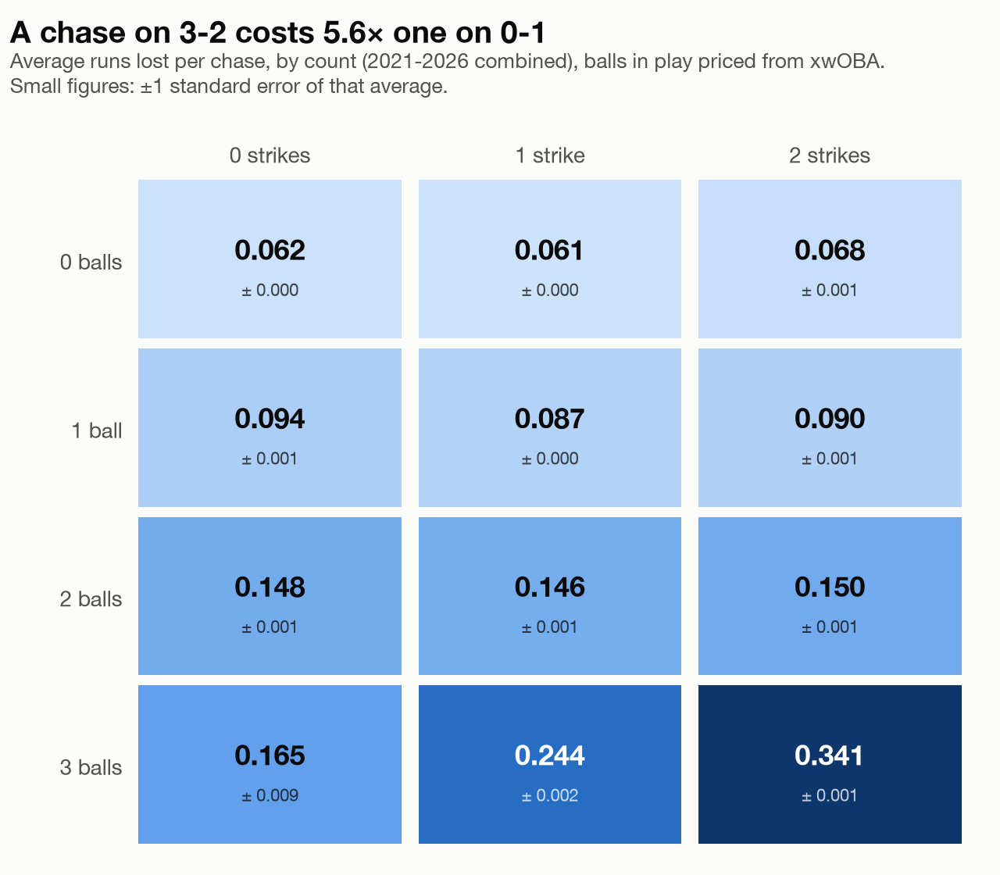
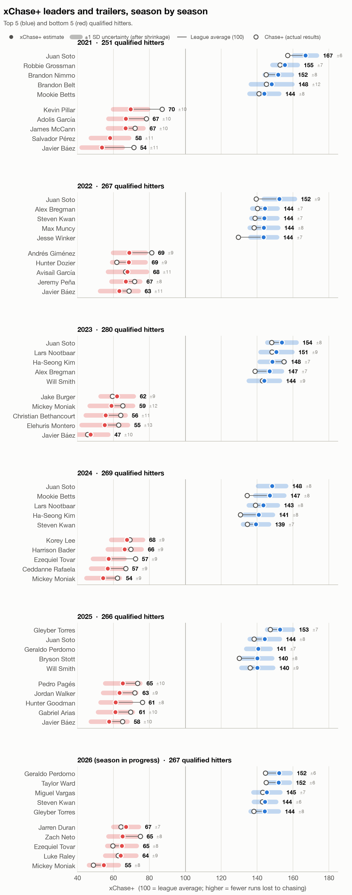
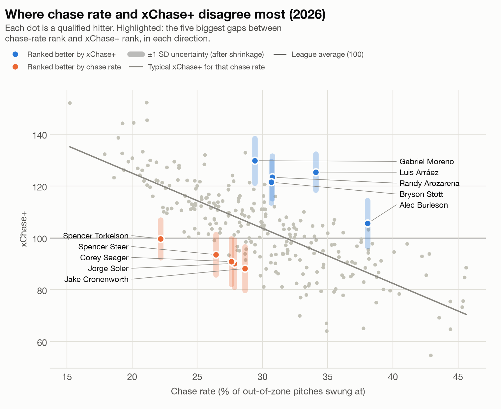
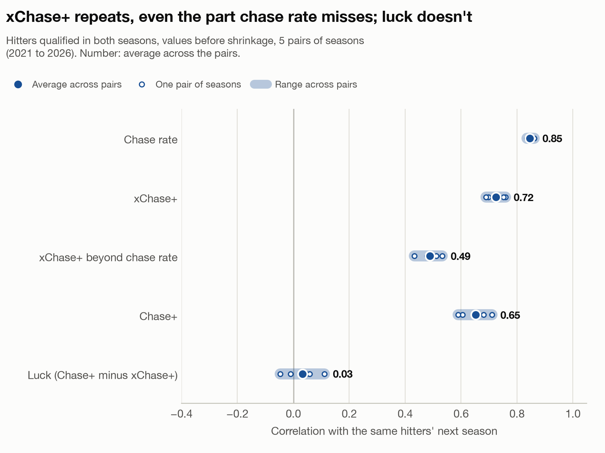
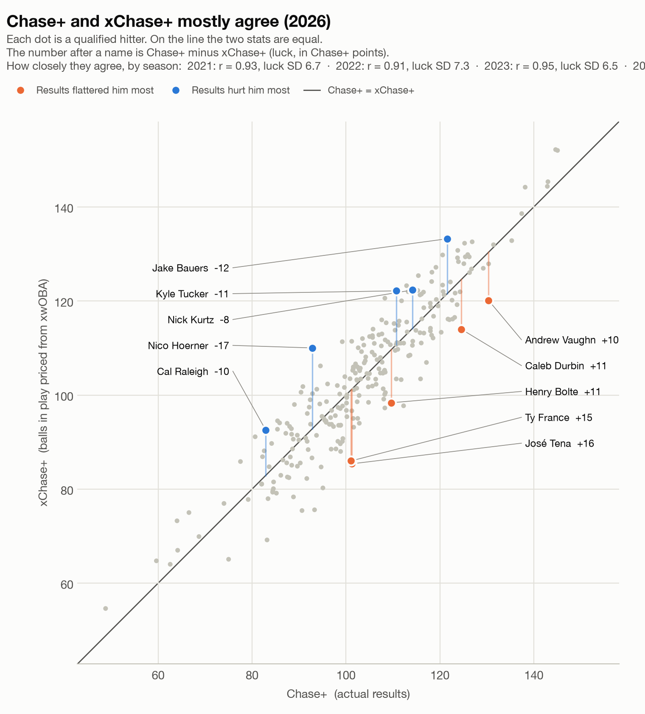

# Chase Value (xChase+ and Chase+)

Chase rate counts how often a hitter swings at pitches outside the zone,
and it treats every one of those swings as the same mistake. They aren't.
On average a chase on 3-2 costs about 5.6 times as many runs as a chase on
0-1. This project prices every chase decision in runs using Statcast data,
builds a per-season leaderboard, and then tests whether the numbers hold
up.

It reports two scores on the same scale:

- **xChase+** (the main number, version 1.1) prices a chase put in play
  by how it was hit, using Savant's xwOBA. It measures the decision and
  the contact, not where the ball landed, and it repeats better from one
  season to the next.
- **Chase+** (version 2.0) prices a chase put in play by what actually
  happened: the league value of a single, double, triple, home run or
  out, whatever the runners and outs were. It is the record of the
  season, luck included.

Takes, whiffs and fouls are priced the same way in both. The gap between
them (Chase+ minus xChase+) is called **luck** below. It's the same idea
as xwOBA next to wOBA. See [Version history](#version-history) for what
changed between versions.

**How to read the charts:** a solid mark (dot, line or bold number) is the
estimate. The pale band or bar behind it, or the small ± figure, is its
uncertainty. A thin gray line marks the league average (100).

## Results

### Why price chases instead of counting them

<picture>
  <source media="(prefers-color-scheme: dark)" srcset="results/xchase/figures/chase_cost_by_count_dark.png">
  
</picture>

A chase with three balls costs far more than one early in the count.
Chase rate treats those as the same mistake; this project doesn't.

### Leaders and trailers, season by season

<picture>
  <source media="(prefers-color-scheme: dark)" srcset="results/xchase/figures/leaderboard_by_season_dark.png">
  
</picture>

About 250-280 hitters qualify each season. An xChase+ of 130 is about the
top 7% of qualified hitters. The hollow ring is the same hitter's
Chase+; the line between them is luck. Full tables, with both scores and
the luck between them, are in `results/xchase/xchase_leaderboard_<season>.csv`.

<details>
<summary>Top 5 and bottom 5 as tables</summary>

**2021** (251 qualified hitters)

| Rank | Player | PA | Chase% | Runs saved / 600 PA | xChase+ ± 1 SD | Chase+ | Luck |
|---:|---|---:|---:|---:|---|---:|---:|
| 1 | Juan Soto | 635 | 12.2% | +24.5 | **167** ± 6 | 157 | -10 |
| 2 | Robbie Grossman | 668 | 15.7% | +20.3 | **155** ± 7 | 153 | -3 |
| 3 | Brandon Nimmo | 384 | 15.1% | +19.0 | **152** ± 8 | 145 | -7 |
| 4 | Brandon Belt | 378 | 19.0% | +17.6 | **148** ± 12 | 145 | -3 |
| 5 | Mookie Betts | 550 | 18.4% | +16.1 | **144** ± 8 | 141 | -3 |
| | ... | | | | | | |
| 247 | Kevin Pillar | 345 | 36.4% | -11.2 | **70** ± 10 | 87 | +18 |
| 248 | Adolis García | 622 | 35.8% | -12.1 | **67** ± 10 | 78 | +11 |
| 249 | James McCann | 412 | 32.1% | -12.2 | **67** ± 10 | 72 | +5 |
| 250 | Salvador Pérez | 660 | 45.3% | -15.4 | **58** ± 11 | 58 | +0 |
| 251 | Javier Báez | 547 | 44.7% | -17.0 | **54** ± 11 | 71 | +18 |

**2022** (267 qualified hitters)

| Rank | Player | PA | Chase% | Runs saved / 600 PA | xChase+ ± 1 SD | Chase+ | Luck |
|---:|---|---:|---:|---:|---|---:|---:|
| 1 | Juan Soto | 662 | 17.1% | +18.6 | **152** ± 9 | 139 | -13 |
| 2 | Alex Bregman | 655 | 18.2% | +15.8 | **144** ± 7 | 140 | -4 |
| 3 | Steven Kwan | 635 | 20.3% | +15.7 | **144** ± 7 | 139 | -5 |
| 4 | Max Muncy | 564 | 16.4% | +15.6 | **144** ± 8 | 138 | -6 |
| 5 | Jesse Winker | 546 | 18.6% | +15.5 | **144** ± 7 | 130 | -14 |
| | ... | | | | | | |
| 263 | Andrés Giménez | 550 | 38.9% | -11.1 | **69** ± 9 | 81 | +12 |
| 264 | Hunter Dozier | 500 | 33.0% | -11.2 | **69** ± 9 | 62 | -7 |
| 265 | Avisaíl García | 382 | 41.1% | -11.5 | **68** ± 11 | 67 | -1 |
| 266 | Jeremy Peña | 556 | 38.0% | -11.8 | **67** ± 8 | 72 | +5 |
| 267 | Javier Báez | 590 | 47.7% | -13.1 | **63** ± 11 | 69 | +5 |

**2023** (280 qualified hitters)

| Rank | Player | PA | Chase% | Runs saved / 600 PA | xChase+ ± 1 SD | Chase+ | Luck |
|---:|---|---:|---:|---:|---|---:|---:|
| 1 | Juan Soto | 706 | 16.6% | +20.4 | **154** ± 8 | 148 | -6 |
| 2 | Lars Nootbaar | 505 | 17.0% | +19.3 | **151** ± 9 | 148 | -3 |
| 3 | Ha-Seong Kim | 627 | 20.5% | +18.4 | **148** ± 7 | 155 | +7 |
| 4 | Alex Bregman | 721 | 18.7% | +17.8 | **147** ± 7 | 139 | -8 |
| 5 | Will Smith | 548 | 25.6% | +16.7 | **144** ± 9 | 143 | -1 |
| | ... | | | | | | |
| 276 | Jake Burger | 539 | 38.9% | -14.4 | **62** ± 9 | 59 | -3 |
| 277 | Mickey Moniak | 319 | 46.9% | -15.6 | **59** ± 12 | 65 | +6 |
| 278 | Christian Bethancourt | 333 | 45.3% | -16.8 | **56** ± 11 | 64 | +8 |
| 279 | Elehuris Montero | 306 | 43.7% | -17.0 | **55** ± 13 | 63 | +8 |
| 280 | Javier Báez | 542 | 44.4% | -20.0 | **47** ± 10 | 46 | -2 |

**2024** (269 qualified hitters)

| Rank | Player | PA | Chase% | Runs saved / 600 PA | xChase+ ± 1 SD | Chase+ | Luck |
|---:|---|---:|---:|---:|---|---:|---:|
| 1 | Juan Soto | 710 | 18.0% | +17.5 | **148** ± 8 | 148 | +0 |
| 2 | Mookie Betts | 516 | 21.2% | +17.0 | **147** ± 8 | 134 | -13 |
| 3 | Lars Nootbaar | 404 | 17.0% | +15.7 | **143** ± 8 | 139 | -4 |
| 4 | Ha-Seong Kim | 469 | 18.8% | +14.8 | **141** ± 8 | 131 | -10 |
| 5 | Steven Kwan | 543 | 19.2% | +14.2 | **139** ± 7 | 135 | -5 |
| | ... | | | | | | |
| 265 | Korey Lee | 395 | 35.2% | -11.7 | **68** ± 9 | 69 | +2 |
| 266 | Harrison Bader | 434 | 33.6% | -12.2 | **66** ± 9 | 70 | +3 |
| 267 | Ezequiel Tovar | 695 | 43.8% | -15.4 | **57** ± 9 | 72 | +15 |
| 268 | Ceddanne Rafaela | 569 | 46.7% | -15.6 | **57** ± 9 | 67 | +10 |
| 269 | Mickey Moniak | 418 | 39.1% | -16.6 | **54** ± 9 | 62 | +8 |

**2025** (266 qualified hitters)

| Rank | Player | PA | Chase% | Runs saved / 600 PA | xChase+ ± 1 SD | Chase+ | Luck |
|---:|---|---:|---:|---:|---|---:|---:|
| 1 | Gleyber Torres | 627 | 17.2% | +19.5 | **153** ± 7 | 147 | -5 |
| 2 | Juan Soto | 707 | 15.9% | +16.4 | **144** ± 8 | 138 | -6 |
| 3 | Geraldo Perdomo | 720 | 19.0% | +15.1 | **141** ± 7 | 141 | +0 |
| 4 | Bryson Stott | 563 | 23.4% | +14.9 | **140** ± 8 | 130 | -10 |
| 5 | Will Smith | 438 | 19.4% | +14.9 | **140** ± 9 | 136 | -4 |
| | ... | | | | | | |
| 262 | Pedro Pagés | 388 | 35.9% | -12.9 | **65** ± 10 | 73 | +8 |
| 263 | Jordan Walker | 394 | 34.1% | -13.5 | **63** ± 9 | 72 | +9 |
| 264 | Hunter Goodman | 577 | 36.9% | -14.4 | **61** ± 8 | 76 | +15 |
| 265 | Gabriel Arias | 470 | 39.0% | -14.4 | **61** ± 10 | 70 | +8 |
| 266 | Javier Báez | 435 | 46.2% | -15.7 | **58** ± 10 | 65 | +7 |

**2026** (267 qualified hitters, season in progress)

| Rank | Player | PA | Chase% | Runs saved / 600 PA | xChase+ ± 1 SD | Chase+ | Luck |
|---:|---|---:|---:|---:|---|---:|---:|
| 1 | Geraldo Perdomo | 608 | 21.1% | +23.0 | **152** ± 6 | 145 | -8 |
| 2 | Taylor Ward | 590 | 15.2% | +22.9 | **152** ± 6 | 145 | -7 |
| 3 | Miguel Vargas | 619 | 21.2% | +20.0 | **145** ± 7 | 143 | -2 |
| 4 | Steven Kwan | 567 | 20.1% | +19.5 | **144** ± 6 | 143 | -1 |
| 5 | Gleyber Torres | 376 | 19.3% | +19.4 | **144** ± 8 | 138 | -6 |
| | ... | | | | | | |
| 263 | Jarren Duran | 565 | 34.9% | -14.5 | **67** ± 7 | 64 | -3 |
| 264 | Zach Neto | 621 | 37.7% | -15.4 | **65** ± 8 | 75 | +10 |
| 265 | Ezequiel Tovar | 463 | 44.4% | -15.5 | **65** ± 8 | 60 | -5 |
| 266 | Luke Raley | 284 | 34.9% | -15.8 | **64** ± 9 | 63 | -1 |
| 267 | Mickey Moniak | 392 | 42.9% | -20.0 | **55** ± 8 | 49 | -6 |

Luck is Chase+ minus xChase+. Hitters at the top of a list sorted by
xChase+ tend to have negative luck (and the bottom positive luck): that's
partly what put them at the extremes.

</details>

### What chase rate misses

<picture>
  <source media="(prefers-color-scheme: dark)" srcset="results/xchase/figures/chase_plus_vs_chase_rate_dark.png">
  
</picture>

Some hitters chase often but mostly when it's cheap, and some rarely
chase but pay for it when they do. The highlighted hitters are the
biggest disagreements between the two rankings. Compared like for like,
xChase+ correlates 0.30-0.35 with a hitter's xwOBA each season, against
0.23-0.30 (negative) for chase rate. See the appendix for how that's
measured, and for what it does and doesn't say about next season.

### Does it repeat?

<picture>
  <source media="(prefers-color-scheme: dark)" srcset="results/xchase/figures/reliability_chase_vs_xchase_dark.png">
  
</picture>

Yes. Across the five pairs of seasons from 2021 to 2026, xChase+ repeats at
r = 0.69-0.76 (0.72 on average), Chase+ at 0.59-0.71 (0.65), and luck not
at all (-0.05 to 0.11; 0.03). xChase+ beats Chase+ in every pair. That's
the reason xChase+ is the main number: taking the ball-in-play luck out
leaves more of the hitter. Both are noisier than plain chase rate (0.84-0.86),
which only counts chases and doesn't price them.

Chase rate alone explains 58-72% of the spread in xChase+ within a
season, so part of xChase+ repeating is just chase rate repeating. The
part chase rate doesn't explain (what's left after a straight-line fit
on chase rate, each season) still repeats at r = 0.43-0.53 (0.49). That
part is what pricing chases adds over counting them, and it carries over
from one season to the next. The same part of Chase+ repeats at
0.34-0.46 (0.40); xChase+ is ahead in every pair here too. The per-stat scatter
plots are in `results/xchase/figures/reliability.png` and
`results/chase/figures/reliability.png`.

## How it works

1. **Price each chase.** Cost = the value of taking the pitch minus the value
   of what the swing produced. Both values come from count run values built
   from that season's games. The take side weighs "ball" against "called strike" using
   a called-strike model. That model is a logistic regression fit separately
   for each season, on distance outside the zone plus the count. A whiff adds
   a strike, a foul adds a strike unless there are already two. A ball in
   play is worth, for Chase+, the league-average run value of its outcome
   that season: single, double, triple, home run or out (double plays,
   fielder's choices, sacrifices and reaching on an error count as outs,
   as in wOBA). For xChase+ it gets a value from its xwOBA instead (a
   straight line fit, each season, from xwOBA to those same outcome
   values on chases put in play). Neither depends on the runners or outs,
   so the swing side is context neutral like the take side. The roughly
   1% of balls in play with no xwOBA keep their outcome's value in both.
2. **Compare to the league.** Each pitch is compared with what the league
   lost on average on the same kind of pitch: same season, count and
   distance bucket. That way a hitter isn't charged for working deep counts
   or credited for taking pitches nowhere near the zone.
3. **Shrink small samples.** Each hitter-season is pulled toward its
   season's mean in proportion to its standard error, using the
   DerSimonian-Laird estimator.
4. **Put it on a 100 scale.**

   ```
   xchase_plus = 100 + 100 * runs_saved_shrunk / league_chase_cost_per_600_pa
   ```

   (Chase+ is the same formula on the Chase+ run.) 100 is league average.
   130 means a hitter saved runs worth 30% of what an average hitter lost
   to chasing that season. The xwOBA line keeps the league's average
   ball-in-play value unchanged, so both scores use the same league scale.

Everything is computed one season at a time: the run value tables, the
called-strike model, the league baseline, shrinkage, ranks and
qualification floors. Adding or removing a season never changes another
season's numbers. The league
environment shifts from year to year, and 2026 is the first season under
MLB's ABS Challenge System.

## Reading the leaderboard

| Question | Column |
|---|---|
| Who was better within one season? | `runs_saved_shrunk` (runs per 600 PA vs. that season's league) |
| Who was more dominant, comparable across seasons? | `xchase_plus` (100 = league average) |
| How many runs on one fixed yardstick? | `runs_saved_vs_anchor_shrunk` (every season priced against 2024) |

- **League chase cost:** the league lost 36.7, 35.6, 38.0, 36.1, 37.1 and
  44.0 runs per 600 PA to chasing in 2021 through 2026.
- **Where the files are:** everything for xChase+ is in `results/xchase/`
  (along with the files that compare the two) and everything for Chase+ in
  `results/chase/`, with the same file names. The run value tables both
  use are in `results/run_values/`. In
  the xChase+ files the score columns are named `xchase_plus`,
  `xchase_plus_se`, ... so the two can't be mixed up.
- **Uncertainty:** the charts and tables show ± `xchase_plus_posterior_sd`,
  the uncertainty left after shrinkage (usually 7-10 points; 9-12 for
  Chase+). The files also have `xchase_plus_se`, the standard error before
  shrinkage (usually about 10 points; about 12 for Chase+). xChase+ is
  more precise because an xwOBA value varies less than an actual result.
- **Other files:** `chase_cost_leaderboard.csv` adds each hitter's qualified
  seasons into one career line. `hitter_value_leaderboard.csv` places chase
  value next to total offense. `xchase_leaderboard_<season>.csv` ranks by
  xChase+ with Chase+, both ranks and luck alongside. `matchups/` has
  xChase+ by handedness matchup (see the appendix).
- **Version:** the `stat_version` column of `chase_plus_league_scale.csv`
  says which version of the stat a results folder was built with.

**Qualifying:** a hitter needs 600 out-of-zone pitches seen and 300 plate
appearances in a season. A season still in progress gets proportionally
lower floors. 2026 currently has 90% of a full season's games. There is no
chase-count minimum, but `cost_per_chase` is left blank for hitters with
fewer than 120 chases.

## Limitations

- **xwOBA only knows exit velocity and launch angle.** It ignores spray
  direction and sprint speed, so a hitter who beats xwOBA every year for
  those reasons would be understated by xChase+. Luck doesn't repeat in
  any of the five pairs of seasons, so there's no sign of that.
- **The xwOBA line is fit on chases only.** Its implied wOBA scale is
  1.15-1.21 each season, at or a little below the usual 1.2-1.25, because
  it is fit on chased balls in play priced in this project's own run
  values.
- **Chase+ treats every out the same.** A chased ball in play that ends
  in a double play, a sacrifice fly, a fielder's choice or an error is
  priced as an average out, because those depend on the runners and the
  fielders. That keeps Chase+ context neutral, but it also means a
  productive out gets no extra credit.
- **Shrinkage is a little too strong at the extremes.** The most and least
  disciplined hitters come out about 3 runs per 600 PA too close to average
  (7-8 Chase+ points), so the top and bottom values are understated.
- **The called-strike model ignores which side of the zone a pitch
  missed.** Takes just above the zone are called strikes more often than
  the model predicts, and corners less often. This changes hitter values
  by roughly 0.2-0.4 runs per 600 PA.
- **Each season's run values come from that season alone.** That keeps
  seasons independent, but a part-season (2026 so far) has noisier run
  expectancy for rare base-out states than a full one.
- **2026 is harder to compare with earlier years.** It is an in-progress
  season, and Statcast records its zone boundaries differently from
  earlier seasons. The models show 2026 calls differing from earlier seasons but
  can't say why.

## Running it

```
python -m venv .venv
source .venv/bin/activate
pip install -r requirements.txt
```

Run the scripts in order. Each one overwrites its own outputs. Steps 4-8
build Chase+; rerun them with `--expected-contact` to build the same
files for xChase+ into `results/xchase/` (the charts go to
`results/xchase/figures/`). Chase+ goes to `results/chase/`, and neither
run touches the other's files.

| Step | Script | What it does |
|---|---|---|
| 1 | `scripts/01_download_baseline.py` | Downloads Statcast data by month with `pybaseball` into `data/raw/` |
| 2 | `scripts/02_build_chase_dataset.py` | Cleans and labels pitches (swing, zone, chase), keeps xwOBA |
| 3 | `scripts/03_build_run_value_tables.py` | Builds run expectancy, event and count run values |
| 4 | `scripts/04_build_chase_leaderboard.py` | Prices chases, fits the models, writes the leaderboards |
| 5 | `scripts/05_build_hitter_value_leaderboard.py` | Compares chase value with total offense |
| 6 | `scripts/06_build_chase_reliability.py` | Tests year-to-year repeatability |
| 7 | `scripts/07_check_chase_invariants.py` | Runs the consistency checks (below) |
| 8 | `scripts/08_make_figures.py` | Draws the charts and prints the README tables |
| 9 | `scripts/09_build_xchase_comparison.py` | Lines up Chase+ and xChase+, tests both against wOBA / xwOBA (needs step 4 both ways) |
| 10 | `scripts/10_make_xchase_figures.py` | Draws the two charts that compare them |
| 11 | `scripts/11_build_matchup_leaderboards.py` | xChase+ leaderboards by handedness matchup (needs step 4 with `--expected-contact`) |

All together:

```
python scripts/01_download_baseline.py
python scripts/02_build_chase_dataset.py
python scripts/03_build_run_value_tables.py

python scripts/04_build_chase_leaderboard.py
python scripts/05_build_hitter_value_leaderboard.py
python scripts/06_build_chase_reliability.py
python scripts/07_check_chase_invariants.py
python scripts/08_make_figures.py

python scripts/04_build_chase_leaderboard.py --expected-contact
python scripts/05_build_hitter_value_leaderboard.py --expected-contact
python scripts/06_build_chase_reliability.py --expected-contact
python scripts/07_check_chase_invariants.py --expected-contact
python scripts/08_make_figures.py --expected-contact

python scripts/09_build_xchase_comparison.py
python scripts/10_make_xchase_figures.py
python scripts/11_build_matchup_leaderboards.py
```

`04_build_chase_leaderboard.py` prints a short summary by default. Add
`--diagnostics` for the model and calibration tables, or `--verbose` for
full explanations too. Those two flags only change what is printed.

`09_build_xchase_comparison.py` first checks that the two runs differ only on
balls in play (same data, same hitter-seasons, same takes, whiffs and
fouls, same league scale) and stops if not. Then it writes, in
`results/xchase/`:

- `xchase_leaderboard_<season>.csv`: ranked by xChase+, with Chase+, both
  ranks, luck, its standard error and z-score
- `xchase_comparison_<season>.csv`: the same hitters sorted by luck
- `regression_candidates.csv`: hitters whose luck is at least 2 standard
  errors from zero, and which way their Chase+ should move
- `xchase_reliability.csv`: year-to-year correlations of Chase+, xChase+
  and luck
- `offense_same_season.csv`: Chase+ against wOBA and xChase+ against
  xwOBA, same season
- `offense_next_season.csv`: whether each stat says anything about next
  season's xwOBA beyond this season's xwOBA and chase rate

The Statcast data files in `data/` are not committed, because the raw pull
is several hundred MB. `results/` is committed, so the leaderboards and
charts can be viewed without running anything.

## Checks

`python scripts/07_check_chase_invariants.py` rebuilds the key numbers from
the pitch level and runs 22 checks, including:

- league runs saved add to zero and league Chase+ is exactly 100
- qualification follows the stated rule
- shrinkage matches DerSimonian-Laird and never overshoots
- the called-strike rate never rises with distance
- the out-of-fold model check doesn't leak
- the results on disk came from the current script and data (checked with
  a fingerprint)
- the files use the right column names for their run (`chase_plus` or
  `xchase_plus`)

Add `--expected-contact` to run the same checks on the xChase+ files, and
`--rerun` to also rerun the leaderboard and confirm it writes
byte-identical files (a 23rd check).

## Appendix: Chase+ vs xChase+

<picture>
  <source media="(prefers-color-scheme: dark)" srcset="results/xchase/figures/chase_plus_vs_xchase_plus_dark.png">
  
</picture>

They mostly agree: r = 0.91-0.95 in every season from 2021 to 2026. Swing
decisions drive most of both, and those are priced the same way. Luck has
an SD of 5.8-7.3 points and doesn't repeat from one season to the next,
so it looks like ball-in-play luck rather than a skill xwOBA misses.
2022 stands out a little: the two agree least that season (r = 0.91) and
luck spreads the most (SD 7.3).

**Regression candidates.** 12, 17, 20, 12, 13 and 14 hitters had luck at
least 2 standard errors from zero in 2021 through 2026 (4.8%, 6.4%, 7.1%,
4.5%, 4.9% and 5.2%). About 4.6% would land there by chance alone, so this
is a list of who to watch, not proof anyone was lucky; only 2022 and 2023
run clearly above chance. The list splits about evenly between hitters
whose Chase+ should fall (46) and rise (42). The standard error of luck
comes from how each ball was hit (the league's typical luck on balls
with the same xwOBA), not from the hitter's own results, so a few lucky
home runs can't also widen his own error bar. See
`results/xchase/regression_candidates.csv`.

**Offense, same season.** Each stat against the matching kind of offense:
Chase+ (actual results) against wOBA, xChase+ (expected) against xwOBA.
Plate appearances that ended on a chase put in play are left out of
wOBA / xwOBA here, because those batted balls are also inside Chase+ and
xChase+.

| Season | Chase+ vs wOBA | xChase+ vs xwOBA | Chase rate vs wOBA | Chase rate vs xwOBA |
|---|---:|---:|---:|---:|
| 2021 | 0.29 | 0.35 | -0.26 | -0.27 |
| 2022 | 0.25 | 0.33 | -0.16 | -0.23 |
| 2023 | 0.28 | 0.35 | -0.22 | -0.27 |
| 2024 | 0.23 | 0.30 | -0.20 | -0.24 |
| 2025 | 0.27 | 0.32 | -0.27 | -0.30 |
| 2026 | 0.27 | 0.32 | -0.17 | -0.27 |

In every season xChase+ tracks expected offense more closely than Chase+
tracks actual offense, and more closely than chase rate does.

**Next season.** For hitters qualified in consecutive seasons: does the
stat say anything about next season's xwOBA once this season's xwOBA and
chase rate are known?

| Seasons | Stat | r with next xwOBA | R² gain | t |
|---|---|---:|---:|---:|
| 2021-22 (181) | xChase+ | 0.23 | 0.000 | -0.3 |
| 2022-23 (191) | xChase+ | 0.20 | 0.003 | -1.1 |
| 2023-24 (192) | xChase+ | 0.24 | 0.001 | -0.5 |
| 2024-25 (189) | xChase+ | 0.29 | 0.001 | 0.6 |
| 2025-26 (187) | xChase+ | 0.13 | 0.009 | -1.6 |
| All (940) | xChase+ | 0.22 | 0.001 | -1.2 |
| All (940) | Chase+ | 0.19 | 0.000 | -0.9 |

No. Both correlate with next year's xwOBA on their own, but that's because
good hitters have good chase decisions: once this year's xwOBA is known,
neither adds anything, and the sign isn't even consistent from one pair of
seasons to the next. With 940 hitter pairs, a gain of about half a percent
of R² or more would likely have shown up. So xChase+ describes a real,
repeatable part of a hitter's approach, but it isn't a hidden predictor
of next year's production.

The Chase+ versions of every chart above are in `results/chase/figures/`.

## Appendix: xChase+ by matchup

A separate look at xChase+, not a change to it: the same priced pitches,
split by handedness matchup (batter/pitcher), with a leaderboard for each
matchup in each season. The overall xChase+ above is still the main
number; these show how a hitter's chase decisions held up in one kind of
matchup.

**The matchup matters.** The average hitter in each matchup, on the main
xChase+ scale:

| Season | R/R | L/L | R/L | L/R |
|---|---:|---:|---:|---:|
| 2021 | 93.2 | 99.2 | 102.9 | 106.5 |
| 2022 | 94.4 | 95.2 | 104.4 | 105.3 |
| 2023 | 93.1 | 97.8 | 103.2 | 106.7 |
| 2024 | 94.5 | 97.9 | 102.1 | 105.3 |
| 2025 | 94.5 | 93.4 | 102.1 | 106.2 |
| 2026 | 94.3 | 97.2 | 102.4 | 104.2 |

Hitters chase worse against same-handed pitchers (93-99) and better
against opposite-handed ones (102-107), every season.

**How the boards work.** Each pitch is compared with what the league
lost on the same kind of pitch in the same matchup (season, matchup,
count and distance bucket), so 100 on a board is the average hitter *in
that matchup*, not the league average. A point is worth the same runs as
on the main leaderboard. To qualify, a hitter needs the main floors
times the league's share of plate appearances against that pitcher hand:
in a full season 79-89 PA and 159-178 out-of-zone pitches against
lefties, 210-221 PA and 421-441 against righties. Each board is shrunk
on its own, like the main one. Switch hitters appear on R/L and L/R, the
side they batted from.

**How much to trust them.** Year to year, hitters on the same board in
both seasons, five pairs of seasons:

| Board | Hitters per pair | r (average) |
|---|---:|---|
| R/R | 96 | 0.70-0.77 (0.74) |
| L/R | 92 | 0.55-0.70 (0.64) |
| R/L | 136 | 0.42-0.56 (0.47) |
| L/L | 41 | 0.24-0.55 (0.44) |

The boards against right-handed pitchers repeat about as well as overall
xChase+. The boards against lefties rest on about a quarter of a
season's pitches and are noisier, so read their extremes with the ± in
mind. Within one season, the gap between a hitter's matchup score and
his overall score is mostly noise, so a big gap isn't on its own a sign
of a real platoon split.

<details>
<summary>2026 top 5 and bottom 5 on each board</summary>

**R/R** (103 qualified hitters, season in progress)

| Rank | Player | Bats | PA | Chase% | xChase+ ± 1 SD | Overall xChase+ |
|---:|---|:---:|---:|---:|---|---:|
| 1 | Taylor Ward | R | 412 | 14.0% | **158** ± 7 | 152 |
| 2 | Miguel Vargas | R | 441 | 21.3% | **147** ± 9 | 145 |
| 3 | Gleyber Torres | R | 263 | 21.8% | **143** ± 9 | 144 |
| 4 | Isaac Paredes | R | 448 | 26.2% | **132** ± 8 | 124 |
| 5 | Alex Bregman | R | 490 | 24.5% | **132** ± 8 | 128 |
| | ... | | | | | |
| 99 | Salvador Pérez | R | 414 | 44.3% | **76** ± 10 | 73 |
| 100 | Trea Turner | R | 418 | 37.0% | **74** ± 9 | 79 |
| 101 | Ezequiel Tovar | R | 317 | 45.4% | **73** ± 10 | 65 |
| 102 | Oswald Peraza | R | 221 | 39.8% | **71** ± 11 | 75 |
| 103 | Zach Neto | R | 450 | 38.8% | **70** ± 9 | 65 |

**L/L** (83 qualified hitters)

| Rank | Player | Bats | PA | Chase% | xChase+ ± 1 SD | Overall xChase+ |
|---:|---|:---:|---:|---:|---|---:|
| 1 | J. P. Crawford | L | 124 | 17.1% | **154** ± 13 | 139 |
| 2 | Jonathan Aranda | L | 171 | 24.1% | **139** ± 11 | 133 |
| 3 | Steven Kwan | L | 171 | 20.4% | **136** ± 10 | 144 |
| 4 | Jake Bauers | L | 144 | 22.3% | **133** ± 12 | 133 |
| 5 | JJ Wetherholt | L | 209 | 21.8% | **131** ± 11 | 128 |
| | ... | | | | | |
| 79 | Brandon Lowe | L | 185 | 40.4% | **78** ± 13 | 82 |
| 80 | Brandon Marsh | L | 125 | 41.5% | **74** ± 13 | 85 |
| 81 | Jac Caglianone | L | 154 | 46.0% | **65** ± 13 | 80 |
| 82 | Andrés Giménez | L | 126 | 44.3% | **57** ± 11 | 69 |
| 83 | Samuel Basallo | L | 91 | 43.6% | **45** ± 13 | 80 |

**R/L** (179 qualified hitters)

| Rank | Player | Bats | PA | Chase% | xChase+ ± 1 SD | Overall xChase+ |
|---:|---|:---:|---:|---:|---|---:|
| 1 | Gleyber Torres | R | 113 | 14.1% | **142** ± 13 | 144 |
| 2 | Ryan Jeffers | R | 116 | 19.4% | **141** ± 13 | 132 |
| 3 | Miguel Vargas | R | 178 | 20.8% | **141** ± 12 | 145 |
| 4 | Junior Caminero | R | 163 | 25.4% | **140** ± 16 | 111 |
| 5 | Taylor Ward | R | 178 | 17.9% | **140** ± 10 | 152 |
| | ... | | | | | |
| 175 | Edmundo Sosa | R | 128 | 48.9% | **73** ± 13 | - |
| 176 | Ozzie Albies | S | 238 | 45.7% | **70** ± 12 | 87 |
| 177 | Ceddanne Rafaela | R | 147 | 44.3% | **69** ± 14 | 85 |
| 178 | Ezequiel Tovar | R | 146 | 42.3% | **68** ± 12 | 65 |
| 179 | Colby Thomas | R | 104 | 40.6% | **59** ± 14 | - |

**L/R** (159 qualified hitters)

| Rank | Player | Bats | PA | Chase% | xChase+ ± 1 SD | Overall xChase+ |
|---:|---|:---:|---:|---:|---|---:|
| 1 | Geraldo Perdomo | S | 422 | 20.8% | **149** ± 7 | 152 |
| 2 | Steven Kwan | L | 396 | 20.0% | **141** ± 7 | 144 |
| 3 | Trent Grisham | L | 349 | 19.0% | **134** ± 7 | 133 |
| 4 | Jakob Marsee | L | 430 | 20.7% | **131** ± 8 | 130 |
| 5 | Kevin McGonigle | L | 443 | 19.5% | **131** ± 7 | 129 |
| | ... | | | | | |
| 155 | Michael Harris | L | 356 | 44.7% | **68** ± 10 | 75 |
| 156 | Colson Montgomery | L | 399 | 33.2% | **62** ± 8 | 70 |
| 157 | Luke Raley | L | 257 | 34.4% | **62** ± 9 | 64 |
| 158 | Mickey Moniak | L | 306 | 42.3% | **60** ± 9 | 55 |
| 159 | Jarren Duran | L | 433 | 36.0% | **59** ± 8 | 67 |

</details>

Full boards for every season are in
`results/xchase/matchups/xchase_matchup_leaderboard_<season>.csv`, the
league table and floors in `xchase_matchup_league.csv`, and the
year-to-year correlations in `xchase_matchup_reliability.csv`.

## Version history

- **xChase+ 1.1, Chase+ 2.0.** A chase put in play is now priced context
  neutral. Chase+ uses the league-average value of its outcome (single,
  double, triple, home run or out) instead of its plate appearance's RE24
  value, which depended on the runners and outs: a chased grounder into a
  double play used to cost far more than the same grounder with the bases
  empty. xChase+'s xwOBA line is now fit to those outcome values. xChase+
  barely moved (r = 0.999 with 1.0, 0.4 points on average, the same top
  and bottom five every season), hence 1.1. Chase+ moved more (r = 0.95
  with 1.0, 4 points on average), hence 2.0. Luck (Chase+ minus xChase+)
  is now only contact luck, its standard error comes from how each ball
  was hit rather than the hitter's own results, and the README adds a
  year-to-year test of the part of xChase+ that chase rate doesn't
  explain.
- **xChase+ 1.0, Chase+ 1.0.** First release.

## Use of AI

AI tools (Claude) were used for code cleanup, refactoring and review, and
to build the chart script. Changes were checked against the invariant
tests above and by comparing outputs before and after on the same data.

## License

Code is released under the MIT License (see `LICENSE`). Statcast data is
the property of MLB Advanced Media and is not covered by this license.
